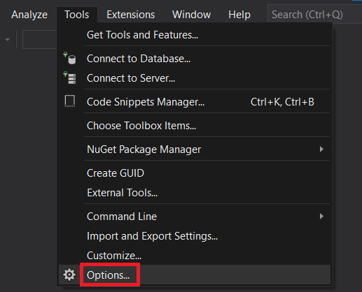
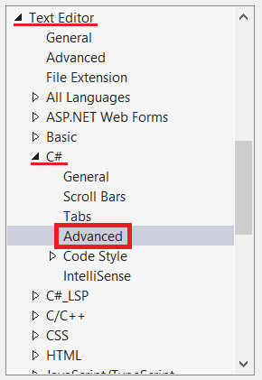
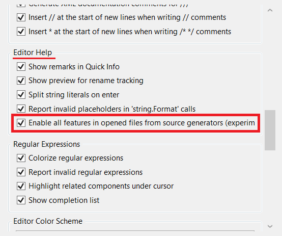

# Fixing Visual Studio issues

When using Visual Studio either as an end-user of Yoakke, or as a library developer, you might encounter an odd issue related to Source Generators:

There are errors appearing in the Error List but in the Output window the build succeeds, still, Visual Studio refuses to start any application in the project. To fix this, please try the steps below.

### 1) First, you should open the `Tools` in the menu bar:

### 2) Then, you go to `Options`:

### 3) You will find a menu called `Text editor`. You open it, then click on `C#` then `Advanced`:

### 4) Make sure the tick box in `Editor Help` called `Enable all features in opened files from source generators` is **ENABLED**:

